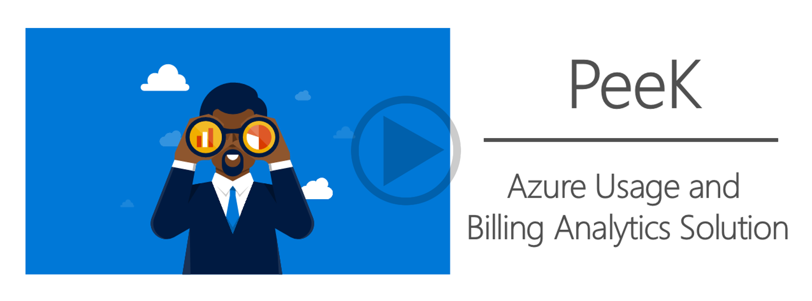
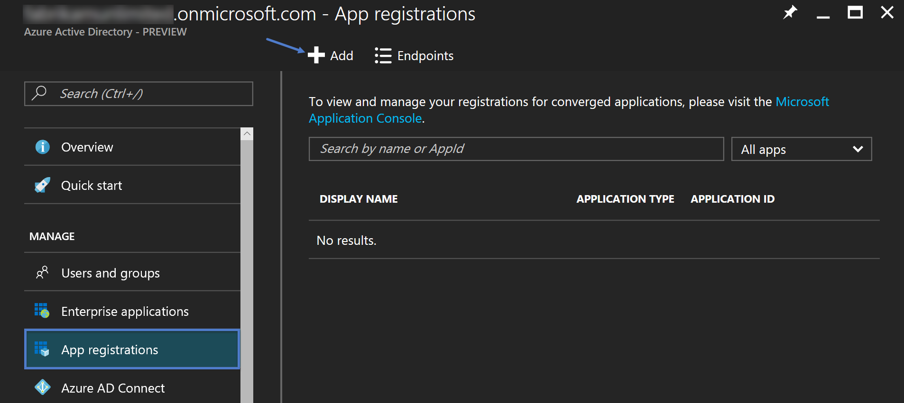
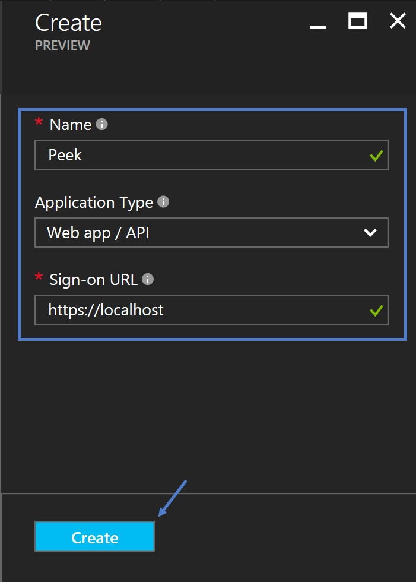
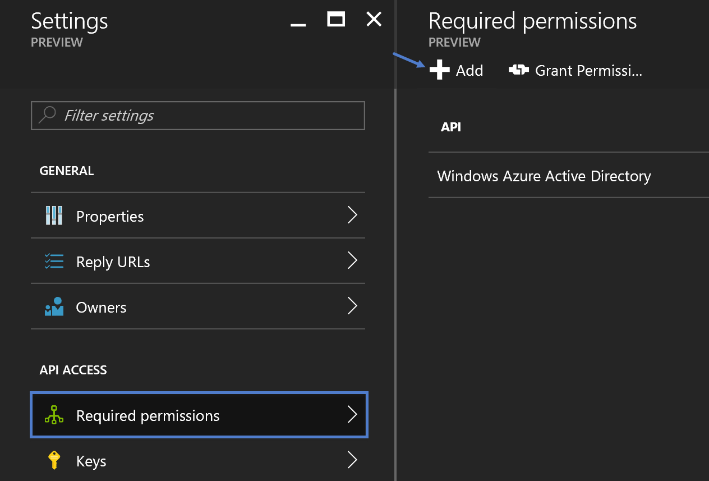
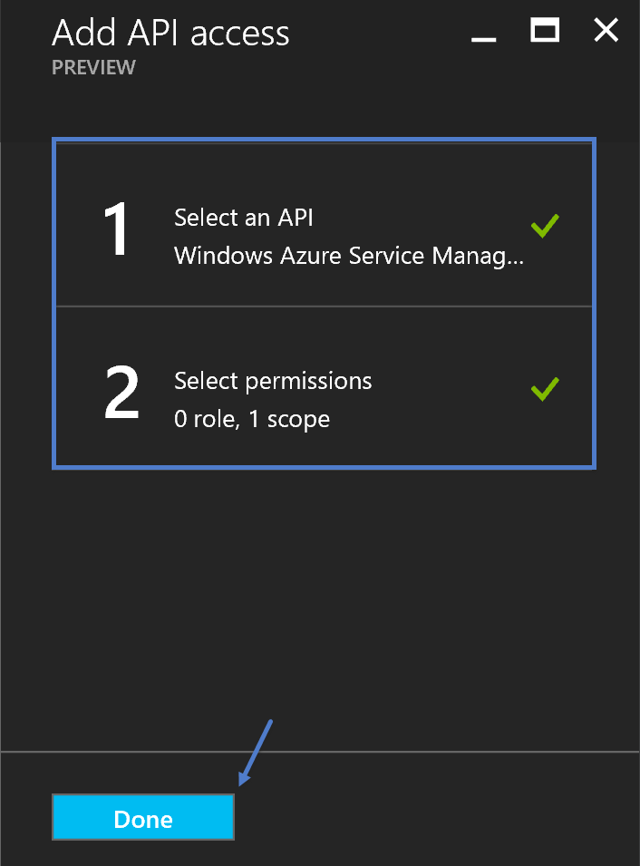
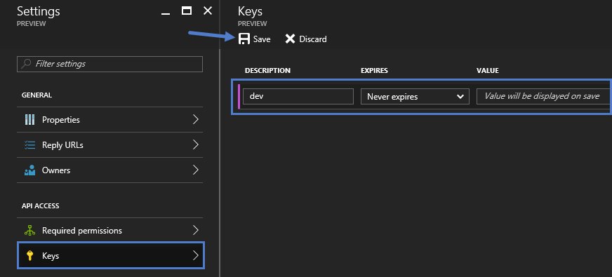
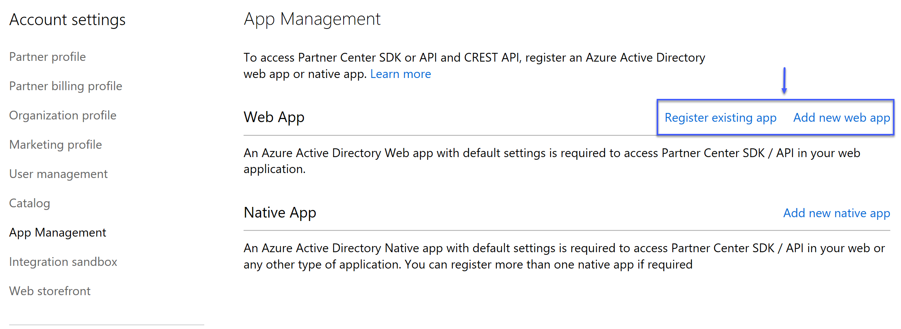
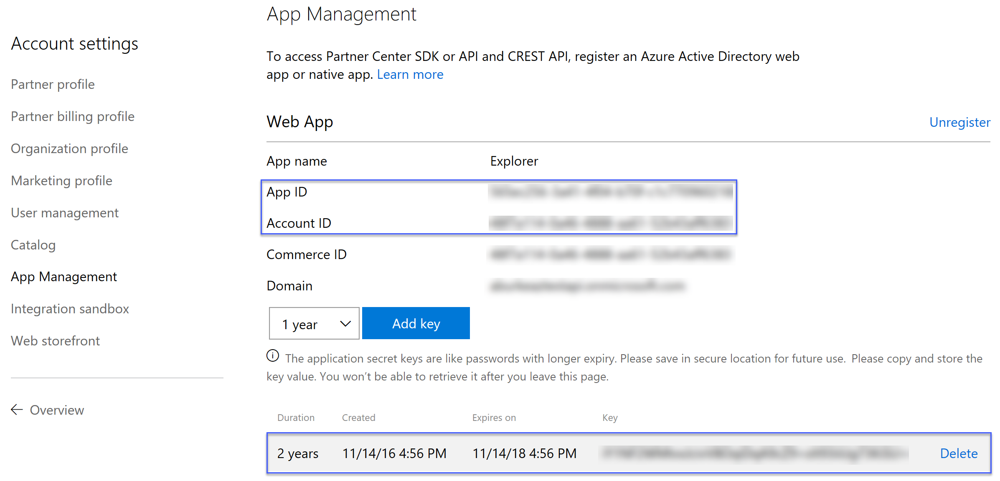

# Peek
Customers are continuing to expand their footprint in Azure and there is a significant need to understand resource usage, optimize it as far as possible and plan for 
future growth. Microsoft Peek is a one stop PaaS based solution which allows us to abstract the intricacies of collecting the usage data for different 
use cases (Cloud Solution Provider, Direct, and Enterprise Agreement Azure subscriptions) and provides detailed visuals for near real time data analytics.

[](https://www.youtube.com/watch?v=aryx-FZjzhc)

### Prerequisites 
The following are _required_ prerequisites for this sample project 

| Prerequisite          | Purpose                                                                                    |
|-----------------------|--------------------------------------------------------------------------------------------|
|  Azure Subscription   | A subscription is required to host the Azure WebJob and provide the Azure Storage account. |

### Obtaining Direct Subscription Information
Usage information for direct Azure subscriptions is obtained using the Azure RateCard and Azure Usage APIs. To access both of these APIs an application must be 
registered within the Azure AD tenant that has access to the subscriptions. Perform the following in order to create and configure the required application

1. Login into https://portal.azure.com using credentials that have _Global Admin_ privileges
2. Open the _Azure Active Directory_ management experience
3. Click on _App registrations_ and then click _Add_ to create a new application

	

4. Specify the appropriate information within the _Create_ blade and then click _Create_

	

5. Click _Required permissions_ on the _Settings_ blade and then click _Add_

	

6. Select the _Windows Azure Service Management API_ and select the _Access Azure Service Management as organization users (preview)_ permissions and then click _Done_

	

7. Click on _Keys_ on the _Settings_ blade and then click _Add_

	

### Obtaining the Cloud Solution Provider (CSP) Information
Microsoft provides the Partner Center API to enable a partner to interact with various aspects of the Cloud Solution Provider program. To access the Partner Center API 
an application must be registered and configured with the partner's Azure AD tenant. Perform the following tasks to create and configure the application. 

1. Login into https://partnercenter.microsoft.com using credentials that have both _AdminAgent_ and _Global Admin_ privileges
2. Click _Dashboard_ -> _Account Settings_ -> _App Management_ 
3. Click on _Register existing app_ if you want to use an existing Azure AD application, or click _Add new web app_ to create a new one

	

4. Document the _App ID_ and _Account ID_ values. Also, if necessary create a key and document that value. 

	

It is important to understand that the creation and configuration of this Azure AD application can be done from the Azure Management portal. However, since this application 
utilizes *app only* authentication to access the Partner Center API the application must be registred in Partner Center using this process. Otherwise, you will receive a 
HTTP 401 error with every attempt to access the Partner Center API.

### Configuring the Application for Pre-consent
Perform the following steps to configure the application that will be used to access the Partner Center API for pre-consent 

1. Install Azure AD PowerShell Module (instruction available [here](https://docs.microsoft.com/en-us/powershell/azuread/)).
2. Update the _AppId_ and _DisplayName_ variables in the PowerShell script below
3. Execute the modified PowerShell script. When prompted for authentication specify credentials that belong to the tenant where the application was created and that have global 
admin privileges  

```powershell
Connect-AzureAD

$AppId = 'INSERT-APPLICATION-ID-HERE'
$DisplayName = 'INSERT-APPLICATION-DISPLAY-NAME-HERE'

$g = Get-AzureADGroup | ? {$_.DisplayName -eq 'AdminAgents'}
$s = Get-AzureADServicePrincipal | ? {$_.AppId -eq $AppId}

if ($s -eq $null) { $s = New-AzureADServicePrincipal -AppId $AppId -DisplayName $DisplayName }
Add-AzureADGroupMember -ObjectId $g.ObjectId -RefObjectId $s.ObjectId
```

## Code of Conduct 
This project has adopted the [Microsoft Open Source Code of Conduct](https://opensource.microsoft.com/codeofconduct/). For more 
information see the [Code of Conduct FAQ](https://opensource.microsoft.com/codeofconduct/faq/) or contact 
[opencode@microsoft.com](mailto:opencode@microsoft.com) with any additional questions or comments.

## License
Copyright (c) Microsoft Corporation. All rights reserved.

Licensed under the [MIT](LICENSE) License.